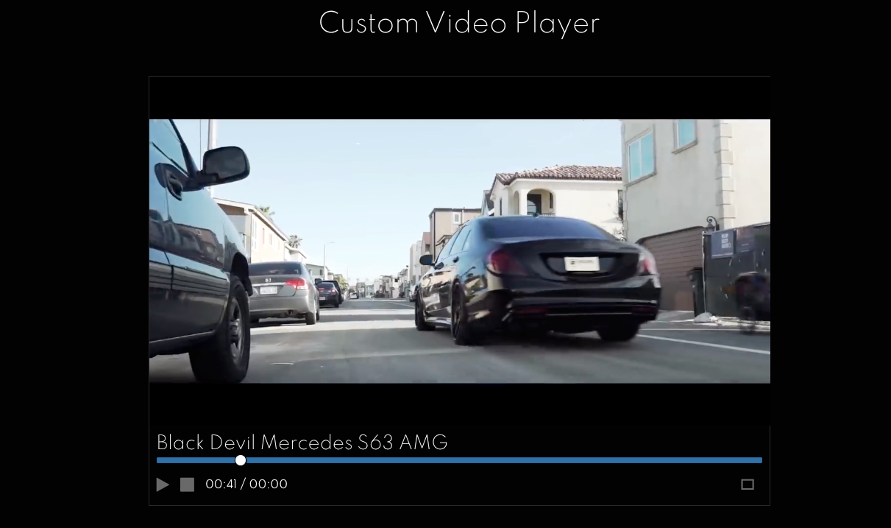

# Vanilla JavaScript Project 004

## Custom Video Player

here U can see final project

<h2 align="center">
  
</h2>

## Project Specifications

Custom video player using the HTML5 video element and it's JavaScript API with a custom design

* Display custom video player styled with CSS
* Play/pause
* Stop
* Video progress bar
* Set progress bar time
* Display time in mins and seconds
* Set full size screen

## Step by step building process:

### Step 1 - HTML STRUCTURE

in assets U can find poster.png file, i use attribute called poster that gives me default image with this .png file. 

### Step 2 - CSS STYLE

In addition to main.css I also have progress.css file witch is basically styling the range input. Because for the video progress I use range input. This file i found on CSS Tricks, there u can find how to style these range inputs with cross browser compatibility.

### Step 3 - JavaScript Play, Pause & Stop

So I have my video player as far as the styling goes and the display the UI but it dosent function, it doesnt do anything. I add functionality to this, so i can play the video and pause, also i can stop.

### Step 4 - JavaScript Video Progress Bar & Timestamp

So now i want this progress bar to scroll along with the video as it plays, and i need to fix timestamp. On the end i add full screen button.

